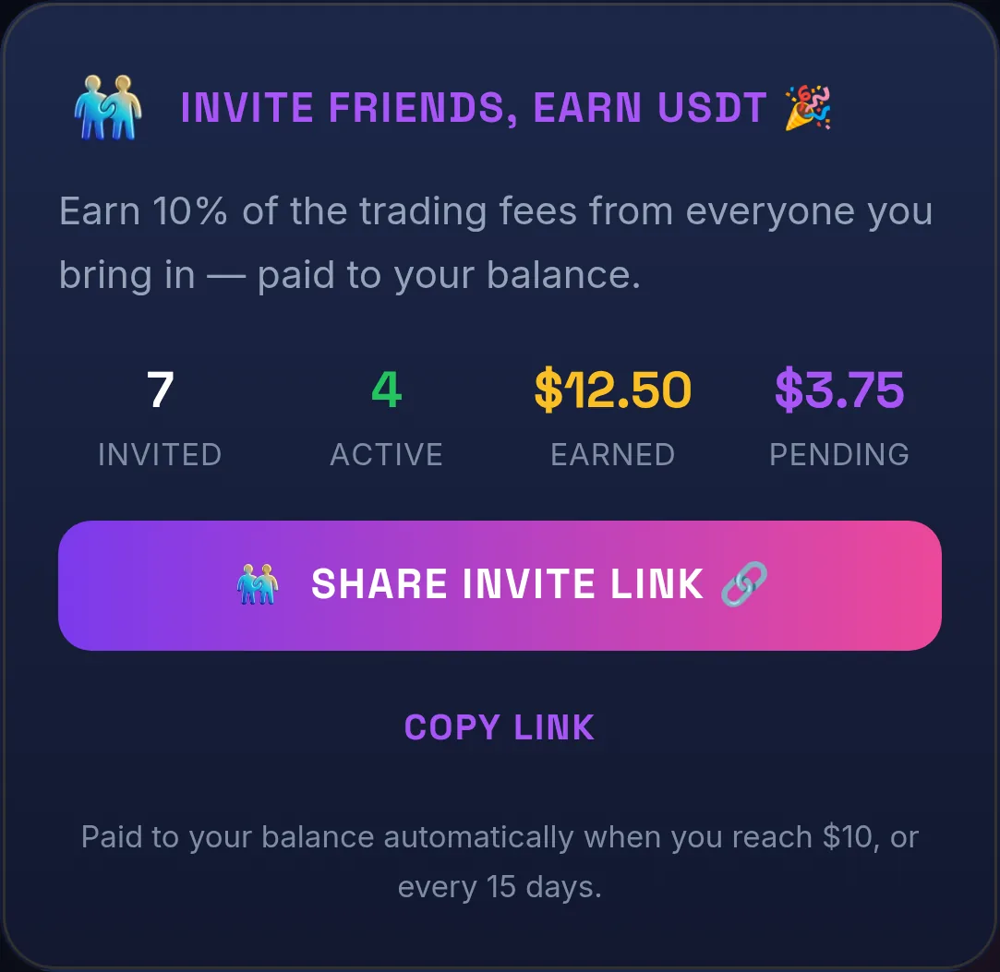

# Invite friends & earn

Bring friends to Fronex and earn **10% of the trading fees they generate** — paid in USDT, straight to your Fronex balance. Your friends pay nothing extra, and it never costs you anything to invite.

## How it works

1. **Grab your link.** Open your **Profile** in the app and tap **Share invite link**. Your link is unique to you.
2. **Share it.** Send it to a friend on Telegram, or anywhere else. When they open Fronex through your link for the first time, they're tied to you as your invite.
3. **Earn as they play.** Every time they take a position, a small trade fee applies ([Fees & payouts](fees.md)). You earn **10%** of that fee — automatically, with nothing to claim.

Your Profile shows your running totals: **Invited** (people who joined through your link), **Active** (those who've started trading), **Earned** (paid out so far), and **Pending** (accrued, not yet paid).

<figure><figcaption>The Invite friends card on your Profile — your reward rate, your stats, and the share link.</figcaption></figure>

## Where the reward comes from

Your reward is paid out of **Fronex's own share** of the trade fee — the platform treasury — **not** out of your friend's money.

* Your friend pays the **exact same fees** as everyone else. Inviting them doesn't make their fees go up.
* You're **never charged** to invite, and your reward is never taken from your friend's deposit or winnings.
* The fee split is identical for referred and non-referred users — there's no hidden surcharge anywhere.

## When you get paid

Rewards are credited to your Fronex balance in USDT **automatically**, whenever one of these happens first:

* your accrued reward reaches **$10**, or
* a periodic payout runs, **every 15 days**.

From your balance you can keep predicting or [withdraw](your-wallet.md) to any TON wallet you control.

## The fine print

* You earn a slice of the fees your friends **actually pay** — so during a [fee-free pillar week](fees.md#trade-fees), or any period a friend doesn't trade, nothing accrues for that activity. This is by design.
* **One invite per person.** A friend is linked to whoever's invite they first opened Fronex through, and that link is set once.
* **No self-inviting.** You can't invite your own second account — and because the reward is only ever a fraction of fees that were genuinely paid, there's nothing to game by spinning up fake accounts.
* Rewards are paid out of the treasury and are **deferred, never overdrawn** — if the treasury can't cover a payout at the time, your accrued amount waits and pays out next cycle rather than failing.

## Getting started

New here first? See [Getting started](getting-started.md) to set up your account, then open your **Profile** to find your invite link.
