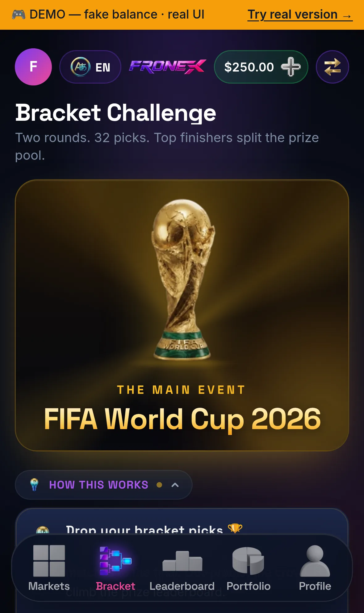

# Leagues

A **League** is a Fronex tournament: a set of markets, one pick per market, a live leaderboard, and — in paid pools — real USDT prizes. Leagues run **inside the app** rather than on the blockchain, so there are no per-pick network fees and the standings update in real time.

> Leagues grew out of the original **Bracket Challenge**. Instead of one platform-run bracket, anyone can now spin up a league over the markets they care about — FIFA World Cup 2026 knockout rounds, a single match-day, a friendly group — and invite people to play.

<figure><figcaption>Leagues — pick across a set of markets, climb the live leaderboard, win bragging rights or a real USDT prize pool.</figcaption></figure>

## Create or join a league

Open **Leagues** from the bottom nav, then either:

* **Create a league.** Give it a name, pick the markets it runs on, set whether it's public or invite-only, and choose an end date. Free, bragging-rights leagues are open to everyone.
* **Join a league.** Browse public leagues under **Discover**, join one from your community, or open a private **invite link** someone shared with you.

**Paid prize pools** (leagues with an entry fee) are currently limited to Fronex and approved organizers, so the prize money behind a pool is always backed. Anyone can create and join **free** leagues.

## Invite people to your league

Once your league exists, open its page and tap **Share** to bring in players. Everything keeps people **inside Telegram** — every invite is a `t.me` link that opens your league straight in the Mini App, so there's no website to visit first:

* **Copy link** — a one-tap invite link to drop into any chat.
* **QR code** — scannable on screen and **downloadable** to print for a watch party, hostel, café, or poster. Scanned outside Telegram, it still opens the app.
* **Share to Telegram** — pick a chat or group from the native share sheet.
* **Share to X** — post the invite as a tweet.

For an **invite-only** league, the link carries your invite code, so whoever opens it can join without hunting for a code. Anyone already in the league can share it — pass it around to fill your leaderboard.

## How a league works

A league is built on a set of **backing markets** — for example, the 16 FIFA World Cup 2026 **Round of 32** matches. For each backing market you make **one pick**.

* Each pick **locks at its match's kickoff**. Until then you can revisit and change it; once the match starts, that pick is read-only.
* You can keep editing your other, not-yet-started picks right up to each of their kickoffs.

## Scoring

Each pick is scored as its backing market resolves:

* A **correct** pick earns points.
* A **wrong** pick loses a smaller number of points.
* If a backing market is cancelled or voided, that pick scores **0** — it doesn't count for or against you.

Your score climbs (or dips) match by match on a **live leaderboard**. You don't need a perfect card to do well — finishing in the **top 30%** earns a badge, and the highest totals take the prizes in a paid pool.

## Prizes and settlement

* **Free leagues** play for the leaderboard and bragging rights — no entry fee, no prize money.
* **Paid pools** pay out real USDT: the prize pool is **100% of entry fees** (Fronex takes no cut on Leagues), plus any seed the organizer adds. It's split among the top finishers on a graded payout.

Settlement runs **inside the app**, the same way trading does: when the league ends, Fronex scores and ranks every entry and **credits each winner's USDT balance automatically**. There's nothing to claim and no deadline — winnings land in your balance as soon as settlement runs, and you can withdraw them to your TON wallet whenever you like.

If a paid pool doesn't reach its minimum number of players, it's **cancelled and every entry fee is refunded** to the player's balance.

## Built to run again

Leagues run on reusable tournament infrastructure — only the source event changes. The FIFA World Cup 2026 knockout rounds are the headline today; after the tournament the same engine carries league competitions such as the Premier League season and Champions League knockouts.
